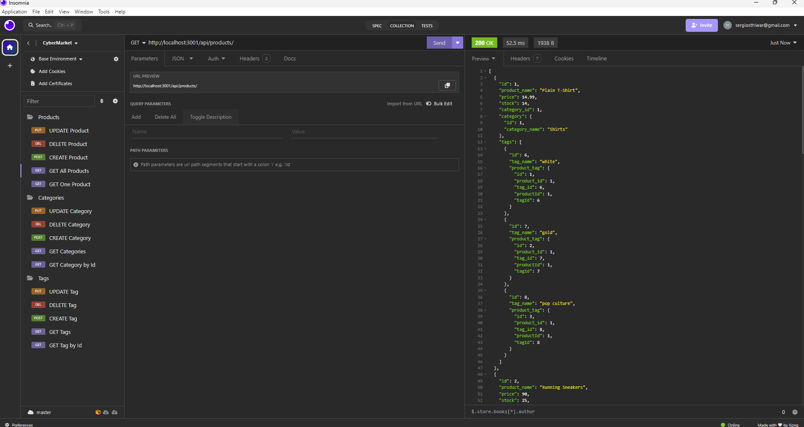

# CyberMarket

## Description  :bookmark_tabs:

CyberMarket is a focused e-commerce platform designed to demystify the backend complexities of online retail. Building this proyect was pivotal for my learning because it aims to empower users with a deeper understanding of backend operations crucial for success in online business ventures. By harnessing technologies like Sequelize and MySQL2, CyberMarket offers tools tailored to empower users in managing their online store effortlessly. With the ability to create, update, and modify products, categories, and tags at their fingertips, users have unparalleled control over every aspect of their online storefront. Throughout the development of CyberMarket, I gained proficiency in various topics of database management, including recognizing different data types, understanding the associations methods, and employing alternative techniques for table creation.

## Installation :computer:

You are able to check this app by two ways:

 1. If you want to check a video of the functionality of the app, you can go to this URL: 
 2. If you want to try it yourself, you have run the code down below.

## Usage :bar_chart:

You have to install the dependencies with the next code:
    
    npm i

 
 ---
After that you have to create a ".env" file following the example:

 
 ---
Open a new terminal and log in to mySQL and run the next code, so we can create the database:

    source db/schema.sql

 
 ---
Now we have to seed data to the database:

    npm run seed
    
    
Now we start the server:

    npm run watch
    

 
 ---
And now we can test it with Imsomnia core, we can find all products, categories and tags; find anything by Id and also create, delete and update any of those:

 ---
 
 ---
 
 ---
## Credits :email:

List of all the links that made me succeed this project:
- https://sequelize.org/docs/v6/core-concepts/validations-and-constraints/
- https://sequelize.org/docs/v7/models/data-types/
- https://www.topcoder.com/thrive/articles/sequelize-validations-and-constraints
- https://github.com/sequelize/sequelize/issues/8019
- https://sequelize.org/docs/v6/core-concepts/model-basics/
- https://sequelize.org/docs/v6/core-concepts/assocs/
- https://learn.microsoft.com/en-us/sql/relational-databases/tables/create-foreign-key-relationships?view=sql-server-ver16
- https://shields.io/badges

## License :memo:
---
---
MIT License

Copyright (c) 2023 Sergio S. Ardila-Alvarado

Permission is hereby granted, free of charge, to any person obtaining a copy
of this software and associated documentation files (the "Software"), to deal
in the Software without restriction, including without limitation the rights
to use, copy, modify, merge, publish, distribute, sublicense, and/or sell
copies of the Software, and to permit persons to whom the Software is
furnished to do so, subject to the following conditions:

The above copyright notice and this permission notice shall be included in all
copies or substantial portions of the Software.

THE SOFTWARE IS PROVIDED "AS IS", WITHOUT WARRANTY OF ANY KIND, EXPRESS OR
IMPLIED, INCLUDING BUT NOT LIMITED TO THE WARRANTIES OF MERCHANTABILITY,
FITNESS FOR A PARTICULAR PURPOSE AND NONINFRINGEMENT. IN NO EVENT SHALL THE
AUTHORS OR COPYRIGHT HOLDERS BE LIABLE FOR ANY CLAIM, DAMAGES OR OTHER
LIABILITY, WHETHER IN AN ACTION OF CONTRACT, TORT OR OTHERWISE, ARISING FROM,
OUT OF OR IN CONNECTION WITH THE SOFTWARE OR THE USE OR OTHER DEALINGS IN THE
SOFTWARE.

---
---
